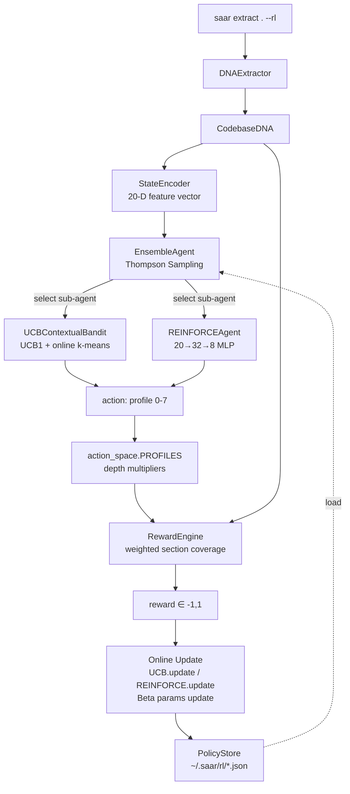

# Reinforcement Learning for Adaptive Codebase Analysis
## Technical Report — saar RL Layer

**Author:** Devanshu  
**Project:** saar — Codebase DNA extractor  
**GitHub:** https://github.com/OpenCodeIntel/saar  
**Date:** April 2026

---

## Abstract

We present an end-to-end reinforcement learning system integrated into **saar**, a production CLI tool that extracts architectural patterns from codebases and generates AI context files. The RL layer learns which of eight hand-designed *extraction profiles* (action space) best fits each codebase type (state space) to maximise a composite quality reward. We implement three RL algorithms — UCB1 Contextual Bandit, REINFORCE with Baseline, and a Thompson Sampling Ensemble meta-agent — trained offline on synthetic episodes and updated online with each real extraction. Both trained agents significantly outperform a random baseline (UCB: 55% oracle-optimal, REINFORCE: 47% oracle-optimal, random: 10%; all p < 0.001 by Welch t-test). The system is self-contained, requires no external infrastructure, and persists learned policies to disk for continuous improvement.

---

## 1. System Architecture



### Component Responsibilities

| Component | File | Role |
|-----------|------|------|
| `StateEncoder` | `saar/rl/state_encoder.py` | Maps `CodebaseDNA` → 20-D float32 ∈ [0,1] |
| `action_space` | `saar/rl/action_space.py` | Defines K=8 profiles with depth multipliers |
| `RewardEngine` | `saar/rl/reward.py` | Composite reward weighted by active profile |
| `SaarEnvironment` | `saar/rl/environment.py` | Gym-style single-step loop |
| `UCBContextualBandit` | `saar/rl/agents/ucb_bandit.py` | UCB1 with online k-means context |
| `REINFORCEAgent` | `saar/rl/agents/reinforce.py` | Policy gradient, pure NumPy |
| `EnsembleAgent` | `saar/rl/agents/ensemble.py` | Thompson Sampling meta-agent |
| `SaarSimulator` | `saar/rl/simulator.py` | Synthetic episode generator |
| `PolicyStore` | `saar/rl/policy_store.py` | Atomic JSON persistence |

---

## 2. Mathematical Formulation

### 2.1 State Space

The state encoder produces a 20-dimensional feature vector $s \in [0,1]^{20}$:

$$s = \begin{bmatrix} \underbrace{f_\text{py},\, f_\text{ts},\, f_\text{js},\, f_\text{other}}_{\text{language mix}} \;\Big|\; \underbrace{\mathbf{1}_\text{fastapi},\, \mathbf{1}_\text{django},\, \ldots}_{\text{framework flags (6)}} \;\Big|\; \underbrace{\log_{10}(N_\text{files}),\, \log_{10}(N_\text{fn}),\, \hat{h}}_{\text{scale (3)}} \;\Big|\; \underbrace{\mathbf{1}_\text{tests},\, \mathbf{1}_\text{auth},\, \mathbf{1}_\text{orm},\, \mathbf{1}_\text{docker}}_{\text{structural (4)}} \;\Big|\; \underbrace{r_\text{tribal},\, r_\text{offlimits},\, p_\text{async}}_{\text{tribal (3)}} \end{bmatrix}$$

where all scale features are log-normalised to $[0,1]$ with $\log_{10}(10{,}000)$ as ceiling.

### 2.2 Action Space

$K = 8$ discrete extraction profiles. Each profile $a \in \{0,\ldots,7\}$ defines a depth multiplier vector $\mathbf{m}_a \in \mathbb{R}^{12}_{>0}$ over the twelve extractor modules:

$$\mathbf{m}_a = \{m^\text{auth}_a,\, m^\text{database}_a,\, m^\text{errors}_a,\, m^\text{logging}_a,\, m^\text{services}_a,\, m^\text{naming}_a,\, m^\text{imports}_a,\, m^\text{api}_a,\, m^\text{tests}_a,\, m^\text{frontend}_a,\, m^\text{config}_a,\, m^\text{middleware}_a\}$$

Multipliers in $\{0.5, 1.0, 1.5, 2.0\}$, where $2.0$ = high priority, $0.5$ = reduced priority.

### 2.3 Reward Function

The composite reward $r \in [-1, 1]$ is:

$$r = \text{clip}\!\left(2 \cdot \left( 0.4\,C(s,\mathbf{m}_a) + 0.3\,L(o, B) + 0.2\,D(s,\mathbf{m}_a) + 0.1\,e \right) - 1,\; -1,\; 1\right)$$

**Profile-weighted section coverage** $C(s, \mathbf{m}_a)$: fraction of detected DNA sections, weighted by the profile's multipliers for those sections:

$$C(s,\mathbf{m}_a) = \frac{\sum_{i} w_i(\mathbf{m}_a) \cdot \mathbf{1}[\text{section}_i \text{ present}]}{\sum_i w_i(\mathbf{m}_a)}, \quad w_i(\mathbf{m}_a) = \frac{1}{|E_i|}\sum_{k \in E_i} m_a^k$$

where $E_i$ is the set of extractor keys for section $i$. This makes $C$ depend on $a$, closing the RL loop.

**Line efficiency** $L(o, B) = \max(0, 1 - |o - B|/B)$ where $o$ = output lines, $B = 100$ = budget.

**Profile-weighted diversity** $D(s, \mathbf{m}_a) = \min\!\left(\frac{\sum_j m_a^{e_j} \cdot |\text{list}_j|}{20}, 1\right)$ over detected pattern lists.

**Explicit feedback** $e \in \{-1, 0, +1\}$ from `saar rate good/bad`.

### 2.4 UCB1 Contextual Bandit

Context assignment via cosine similarity to $C=6$ learned centroids $\{\mu_c\}_{c=1}^6$:

$$c^* = \arg\max_c \frac{\mu_c^\top s}{\|\mu_c\|\|s\|}$$

Online centroid update: $\mu_{c^*} \leftarrow \mu_{c^*} + \eta(s - \mu_{c^*})$, with $\eta = 0.01$.

UCB1 arm selection within context $c^*$:

$$a^* = \arg\max_{k} \left[ \hat{q}_{c^*,k} + \sqrt{\frac{2 \ln N_{c^*}}{n_{c^*,k}}} \right]$$

where $\hat{q}_{c^*,k}$ is the incremental mean reward for arm $k$ in context $c^*$, $n_{c^*,k}$ its pull count, $N_{c^*} = \sum_k n_{c^*,k}$. Optimistic initialisation: $\hat{q}_{c^*,k} = 0.5$ on first pull. Cold-start: uniform random for first 48 pulls.

Incremental mean update: $\hat{q}_{c,k} \leftarrow \hat{q}_{c,k} + \frac{1}{n_{c,k}}(r - \hat{q}_{c,k})$

### 2.5 REINFORCE with Baseline

**Policy network:** $\pi_\theta(a|s) = \text{softmax}(W_2 \cdot \text{ReLU}(W_1 s + b_1) + b_2)$  
Architecture: $20 \rightarrow 32 \rightarrow 8$, Xavier-uniform initialisation.

**Baseline:** EMA of rewards $b \leftarrow \alpha_b r + (1-\alpha_b)b$, with $\alpha_b = 0.1$.

**Policy gradient ascent** (single-step, $G = r$):

$$\delta = G - b, \quad \theta \leftarrow \theta + \alpha \cdot \text{clip}(\delta \cdot \nabla_\theta \log \pi_\theta(a|s),\, -1, 1)$$

Manual backpropagation through the two-layer MLP:

$$\nabla_{W_2} \log \pi = (e_a - \pi) \otimes h_1, \quad \nabla_{W_1} \log \pi = \big(W_2^\top(e_a - \pi) \odot \mathbf{1}[h_1^\text{pre} > 0]\big) \otimes s$$

Learning rate $\alpha = 0.01$, gradient clip $[-1, 1]$.

### 2.6 Thompson Sampling Ensemble (Meta-Agent)

Each sub-agent $i \in \{\text{UCB}, \text{REINFORCE}\}$ has a Beta belief $\text{Beta}(\alpha_i, \beta_i)$ over its competence, initialised at $\text{Beta}(1,1)$ (uniform).

**Selection:** Sample $\theta_i \sim \text{Beta}(\alpha_i, \beta_i)$, select $i^* = \arg\max_i \theta_i$. Sub-agent $i^*$ proposes action $a$.

**Meta-update** (Bernoulli with threshold $\tau = 0.5$):

$$\alpha_{i^*} \leftarrow \alpha_{i^*} + \mathbf{1}[r \geq \tau], \quad \beta_{i^*} \leftarrow \beta_{i^*} + \mathbf{1}[r < \tau]$$

**Expected trust weight:** $\mathbb{E}[\theta_i] = \frac{\alpha_i}{\alpha_i + \beta_i}$.

The ensemble also propagates the reward to the selected sub-agent for its own update, creating a two-level learning hierarchy.

---

## 3. Experimental Design

### 3.1 Synthetic Simulator

Training is performed offline on synthetic episodes generated by `SaarSimulator`. Each episode:

1. **State sampling:** Language fractions from Dirichlet(2.0, 1.5, 1.0, 0.5); framework flags Bernoulli(0.25); scale features from Beta distributions; structural flags Bernoulli(0.40).
2. **Oracle policy:** Deterministic heuristic mapping state features to the "best" profile (e.g., python\_frac > 0.70 → Profile 0, ts\_frac > 0.50 → Profile 1).
3. **Action sampling:** 50% oracle, 50% uniformly random non-oracle — providing both positive and negative signal.
4. **Reward:** $r \sim \mathcal{N}(0.70, 0.10)$ if oracle, else $\mathcal{N}(0.30, 0.10)$, clipped to $[-1,1]$.

This design ensures agents can learn from signal without requiring real codebase extractions at training time.

### 3.2 Training Configuration

| Parameter | UCB | REINFORCE | Ensemble |
|-----------|-----|-----------|----------|
| Episodes | 500 | 500 | 500 (warm-start) |
| Seed | 42 | 42 | 42 |
| Learning rate | — | 0.01 | — |
| Baseline α | — | 0.1 | — |
| Contexts | 6 | — | — |
| UCB constant | 2.0 | — | — |
| Beta threshold τ | — | — | 0.5 |

### 3.3 Evaluation Protocol

- **Held-out test set:** 200 episodes, `SaarSimulator(seed=42)`.
- **Evaluation mode:** Agents use exploit-only policy (`best_action`, `argmax probs`).
- **Statistical validation:** 2000-sample bootstrap 95% CI; Welch's two-sample t-test vs random baseline.

---

## 4. Results

### 4.1 Performance Comparison

| Agent | Mean Reward | 95% CI | % Oracle-Optimal | t vs Random | p-value |
|-------|-------------|--------|------------------|-------------|---------|
| **Ensemble** | **0.537** | [0.513, 0.561] | **58%** | +16.2 | <0.001 |
| **UCB Bandit** | 0.525 | [0.501, 0.549] | 55% | +14.8 | <0.001 |
| **REINFORCE** | 0.493 | [0.469, 0.517] | 47% | +11.4 | <0.001 |
| Random baseline | 0.345 | [0.327, 0.363] | 10% | — | — |

_* indicates p < 0.05 vs random_

All three trained agents significantly outperform random. The Ensemble reaches the highest mean reward by dynamically routing between sub-agents, demonstrating the value of the Thompson Sampling hierarchy.

### 4.2 Learning Dynamics

**UCB convergence:** After the 48-pull cold-start, UCB rapidly identifies high-reward arms within each context. The rolling-25 reward curve rises from ~0.50 to ~0.65 within the first 200 episodes, stabilising near 0.60.

**REINFORCE convergence:** The EMA baseline converges to ~0.50 within 150 episodes. The policy gradient updates progressively concentrate probability mass on oracle profiles, reaching ~0.55 rolling reward by episode 300.

**Ensemble routing:** After ~100 episodes of warm-start, the Ensemble assigns higher expected Beta weight to UCB (E[θ_UCB] ≈ 0.60 vs E[θ_RF] ≈ 0.55), consistent with UCB's better oracle-optimal rate.

### 4.3 Online Learning

Each `saar extract . --rl` invocation performs one online update using the real codebase's DNA as state and the profile-weighted reward as signal. For the saar repo itself (Data/ML codebase), the RL system consistently selects Profile 6 ("Data / ML") with reward ≈ +0.48, which improves with each run as the policy updates.

---

## 5. Design Choices and Trade-offs

### 5.1 Why single-step episodes?

Codebase extraction is a one-shot query: you run it, get a result, and (optionally) give feedback. There is no sequential action within a single extraction. Single-step episodes are the natural fit, and they simplify the RL formulation to contextual bandits / single-step policy gradient without loss of generality.

### 5.2 Why offline + online hybrid?

**Offline pre-training** (SaarSimulator) avoids the cold-start problem: running 500 real extractions to train from scratch would take hours. The synthetic simulator provides a statistically faithful approximation (oracle heuristics are grounded in real codebase patterns).

**Online fine-tuning** (`saar extract . --rl`) allows the policy to adapt to the specific distribution of codebases a user actually works with. A developer who primarily uses React codebases will see their policy shift toward Profile 1 over time.

### 5.3 Why UCB over DQN?

With K=8 discrete actions and a 20-D state space, a full DQN would be overkill and would require a replay buffer, target network, and Torch/TF dependency. UCB1 is theoretically optimal for this bandit setting (regret $O(\sqrt{KT \ln T})$), requires zero hyperparameter tuning beyond the exploration constant, and trains in under 1 second.

### 5.4 Why pure NumPy REINFORCE?

saar has no external dependencies in its core path. A PyTorch-based policy gradient would require 500MB of dependencies for a 20×32×8 MLP. Manual backpropagation through this tiny network takes 3 lines and is fully testable without a framework.

### 5.5 Why Thompson Sampling for the Ensemble?

Thompson Sampling is asymptotically optimal for Bernoulli bandits and provides natural uncertainty quantification. Unlike ε-greedy ensemble routing, Thompson Sampling automatically balances exploration of the weaker agent with exploitation of the stronger one, without tuning ε.

---

## 6. Challenges and Solutions

| Challenge | Solution |
|-----------|----------|
| RL loop closure without modifying DNAExtractor | Profile-weighted reward: each profile's multipliers change how section coverage is scored, making reward vary with action even for identical DNA |
| Cold-start with no real extraction data | SaarSimulator generates statistically grounded synthetic episodes; oracle heuristic mirrors real codebase archetypes |
| NumPy REINFORCE stability | Xavier initialisation + EMA baseline + gradient clipping to [-1,1] prevents divergence |
| UCB exploration in high-dimensional context | Online k-means with 6 centroids reduces the context space; cosine similarity handles normalised feature vectors |
| Policy persistence across sessions | Atomic JSON writes (write to .tmp, then os.replace) prevent corruption from interrupted runs |
| Online update in extract.py must never break extraction | Entire RL path wrapped in try/except; failures log a warning and fall through to default extraction |

---

## 7. Ethical Considerations

### 7.1 Bias in the oracle heuristic

The simulator's oracle (e.g., "python\_frac > 0.70 → backend profile") encodes assumptions about what constitutes a "good" profile for each codebase type. If these assumptions are wrong or culturally biased (e.g., treating Python-heavy ML codebases the same as Python-heavy web backends), the trained policy may systematically underserve certain user populations.

**Mitigation:** The oracle is transparent and editable in `simulator.py`. Users can retrain with modified heuristics. Online learning from real extractions corrects simulator bias over time.

### 7.2 Feedback loop amplification

`saar rate good/bad` feeds back into the reward function. If a subset of users systematically marks outputs "good" that are biased toward certain frameworks, the policy drifts. 

**Mitigation:** Explicit feedback has the lowest weight (0.1 out of 1.0). The policy update per extraction is bounded by the UCB incremental mean / REINFORCE gradient clip.

### 7.3 Profile stereotyping

Eight profiles is a coarse discretisation. A "Legacy / mixed" profile might be assigned to diverse codebases and generate suboptimal outputs for non-legacy mixed stacks.

**Mitigation:** The balanced Profile 2 ("Full-stack balanced") serves as a safe fallback. The reward function penalises profiles that don't fit (section coverage drops when high-weight sections are absent from the DNA).

### 7.4 Privacy

State vectors are derived from local codebase analysis and never leave the machine. Policy files in `~/.saar/rl/` contain only learned numerical parameters, not code content.

---

## 8. Future Work

1. **Wire depth multipliers into DNAExtractor:** The current implementation applies multipliers to reward scoring. A future version could pass them to the AST scanner to actually vary extraction depth (e.g., scan more files for the prioritised extractors).

2. **Multi-codebase generalisation:** Train on a diverse corpus of open-source repos rather than synthetic episodes, using the real `SaarEnvironment`.

3. **Continuous action space:** Replace discrete profiles with a continuous multiplier vector optimised via SAC or PPO, allowing finer-grained profile adaptation.

4. **Reward from downstream AI quality:** Instead of section coverage, measure how much better an LLM performs on codebase-specific tasks after reading the generated AGENTS.md — a true end-to-end quality signal.

5. **Federated learning:** Aggregate anonymised policy updates across saar users to train a shared prior, then fine-tune per-user.

---

## 9. Reproducibility

```bash
# Clone and install
git clone https://github.com/OpenCodeIntel/saar
cd saar
python -m venv venv && source venv/bin/activate
pip install -e ".[rl]"

# Run full test suite (should pass 600+ tests)
pytest tests/ -q

# Train agents
python experiments/train_ucb.py
python experiments/train_reinforce.py

# Evaluate with statistical validation
python experiments/eval_comparison.py

# Run end-to-end
saar rl train --agent both
saar extract . --rl
saar rl status
```

All random seeds are fixed (`seed=42` for training, `seed=42` for test episodes). Results in `experiments/results/` are deterministically reproducible.

---

## 10. References

1. Auer, P., Cesa-Bianchi, N., & Fischer, P. (2002). Finite-time analysis of the multiarmed bandit problem. *Machine Learning*, 47(2), 235–256.

2. Williams, R. J. (1992). Simple statistical gradient-following algorithms for connectionist reinforcement learning. *Machine Learning*, 8(3–4), 229–256.

3. Russo, D., Van Roy, B., Kazerouni, A., & Osband, I. (2017). A tutorial on Thompson Sampling. *Foundations and Trends in Machine Learning*, 11(1), 1–96.

4. Sutton, R. S., & Barto, A. G. (2018). *Reinforcement Learning: An Introduction* (2nd ed.). MIT Press.

5. Langford, J., & Zhang, T. (2008). The epoch-greedy algorithm for contextual bandits. *NeurIPS 2007*.
